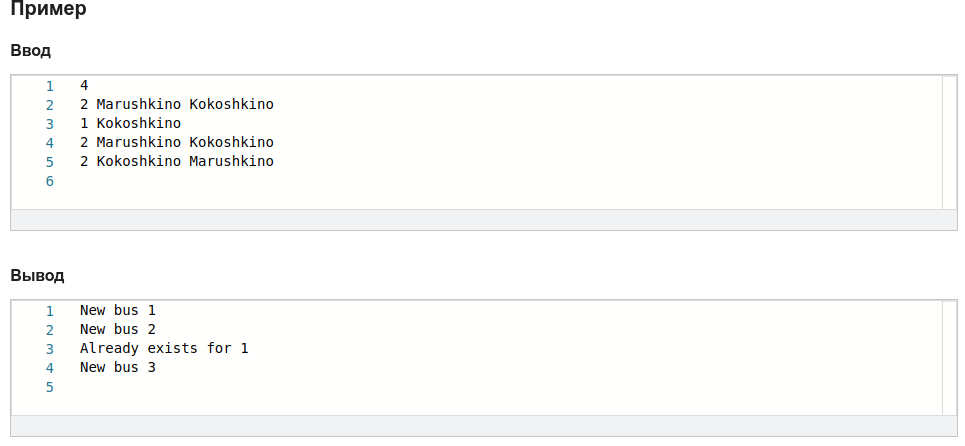

В этой задаче вам нужно присваивать номера автобусным маршрутам.

А именно, для каждого маршрута, заданного набором названий остановок, нужно либо выдать новый номер (первому маршруту — 1, второму — 2 и т. д.), либо вернуть номер существующего маршрута, которому соответствует такой набор остановок.

Наборы остановок, полученные друг из друга перестановкой остановок, считаются различными (см. пример).

**Указание**

В C++ ключом словаря может быть не только число или строка, но и другой контейнер, например, vector.

**Формат ввода**

Сначала вводится количество запросов Q, затем Q описаний запросов.

Каждый запрос представляет собой положительное количество остановок N, за которым следуют разделённые пробелом N различных названий остановок соответствующего маршрута. Названия остановок состоят лишь из латинских букв и символов подчёркивания.

**Формат вывода**

Выведите ответ на каждый запрос в отдельной строке.

Если маршрут с данным набором остановок уже существует, в ответ на соответствующий запрос выведите Already exists for i, где i — номер маршрута с таким набором остановок. В противном случае нужно выделить введённому набору остановок новый номер i и вывести его в формате New bus i.

