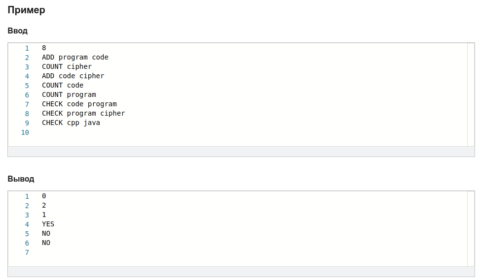

Два слова называются синонимами друг друга, если они имеют похожие значения. Реализуйте следующие операции над словарём синонимов:

* **ADD word1 word2** — добавить в словарь пару синонимов (**word1, word2**).

* **COUNT word** — узнать количество синонимов слова **word**.

* **CHECK word1 word2** — проверить, являются ли слова **word1** и **word2** синонимами. Слова **word1** и **word2** считаются синонимами, если среди запросов **ADD** был хотя бы один запрос **ADD word1 word2** или **ADD word2 word1**.

**Замечание**

Для упрощения, будем считать, что синонимы не обладают транзитивностью, то есть, если A - синоним **B**, а **B** - синоним **C**, то из этого НЕ следует, что **A** - синоним **C**.

**Формат ввода**

Сначала вводится количество запросов **Q**, затем **Q** строк с описаниями запросов. Гарантируется, что в каждом запросе C**HECK** и **ADD** слова **word1** и **word2** различны. Все слова состоят лишь из латинских букв, цифр и символов подчёркивания.

**Формат вывода**

Для каждого запроса в соответствующей строке выведите ответ на него:

* В ответ на запрос **COUNT word** выведите единственное целое число — количество синонимов слова **word**.

* В ответ на запрос **CHECK word1 word2** выведите строку **YES**, если **word1** и **word2** являются синонимами, и **NO** в противном случае.

